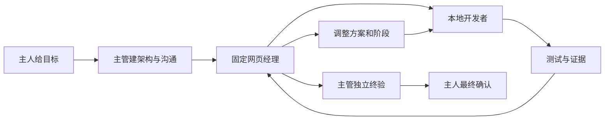

# Web GPT Project Manager

让本地 AI 写代码，让固定网页 GPT 做开发经理，用持久文件与验证证据连接每个阶段。**目标稳定，实施路线可以根据证据调整。**

这是可安装的通用 Agent Skill 与 Python 标准库脚本，不是常驻服务，不会自动创建计时任务，也不提供免费模型额度。

## 四个角色

| 角色 | 工作 |
|---|---|
| 项目主人 | 目标、预算/权限、最终确认 |
| Codex 主管 | 架构与初始化、协作连通、重大纠偏、独立终验 |
| 网页 GPT 经理 | 阶段步骤、证据审核、返工与动态重规划，不写业务代码 |
| AI 开发者 | 本地代码、调试、验证、测试，与经理直接交接 |



经理可拆分/合并阶段、重排任务、替换无法实现的方案；不能暗改用户目标、完成标准、预算或权限。不会要求机械执行初始 P1–P9。每阶段一次沟通，重大冲突例外。

## 朋友首次使用

1. 准备 Python **3.11+**，下载本仓库或 [Release](https://github.com/shiftshen/web-gpt-project-manager/releases)。
2. 在解压/克隆目录执行：

```sh
python3 scripts/install.py
python3 scripts/doctor.py
```

Windows 使用 `python`。默认安装到 `~/.codex/skills/web-gpt-project-manager`；其他智能体可用 `--dest` 指定其技能目录。更新时 `--replace` 会保留旧版本备份，不静默覆盖。

3. 网页经理要读取本机，先按 [WebCodex 配置指南](references/setup.md) 建立连接。本地开发者自身可以没有 WebCodex。
4. 把 [Codex 主管提示词](templates/CODEX_SUPERVISOR_PROMPT.md) 发给主管模型，附上你的项目目标。它应建立维护文件、固定经理会话并验证双向通信，然后返回真实网页链接及两段提示词：交接恢复提示词、握手后的目标提示词。
5. 先把交接提示词交给开发模型；确认握手通过后，再把目标提示词用于开启目标模式。经理通过最终审核后仍需主管与主人最终验收。

已有技能的简短启动语：

> 用 web-gpt-project-manager 技能担任项目主管，初始化项目架构、动态里程碑、固定网页开发经理和双向沟通；验证后给我网页链接及目标模式开发者提示词。本次目标：……

## 文件沟通与故障恢复

每项目的 `.gpt-pm/` 保存目标、章程、架构、里程碑、计划、验收、进度、决策、升级事项和每轮原始证据。源码指纹防止用旧审核批准新代码；测试服务/账号/发布权限仍取决于用户授权。

- [完整命令与生命周期](references/lifecycle.md)
- [动态规划与恢复](references/recovery.md)
- [角色和报告责任](references/reporting.md)
- [第一段：交接提示词](templates/DEVELOPER_HANDOFF_PROMPT.md)
- [第二段：握手后目标提示词](templates/DEVELOPER_GOAL_PROMPT.md)
- [WebCodex 官方链接与首次配置](references/setup.md)

新消息不是新项目：上下文压缩或更换开发者后从持久状态恢复。网页正常执行时等待；重要纠偏允许必要打断与连续短问答，不盲目重发原任务。经理会话确实无法恢复时由主管迁移并重新握手。安全/审批拒绝不作为普通网络故障绕过。

## 验证与边界

```sh
PYTHONDONTWRITEBYTECODE=1 python3 -m unittest discover -s scripts -p 'test_*.py'
```

CI 检查 Linux、macOS、Windows 的纯协议/状态逻辑；**不是三平台浏览器端到端验证**。附带 Chrome 自动化仅在 macOS 实测；其他系统需要宿主浏览器工具或人工辅助。

历史真实 Chrome 测试已验证网页读本机、创建 nonce、写回 REVIEW；完整文档写回曾被平台安全检查拒绝。因此不宣称所有账号都已完成端到端全自动验证；每个新项目必须真实 bootstrap。人工辅助路径不是全自动模式。

同一项目一个本地协调者维护状态；角色门槛是协作约定，不是 OS 隔离或密码学认证。脚本不验证一段文本是否真的来自主人，角色必须据实记录来源。无宿主等待/唤醒能力时不保证无人值守持续运行。

## 致谢

感谢 **[yyjeqhc](https://github.com/yyjeqhc)** 与 **[WebCodex 贡献者](https://github.com/yyjeqhc/webcodex)** 提供云端 AI 访问本机开发环境的能力。我们独立维护协作技能，不是 WebCodex 或 OpenAI 官方产品。详见 [CREDITS.md](CREDITS.md)。

MIT License。发布包不含个人会话、业务代码、账号配置或 WebCodex 凭据。

## v0.2.0 协议收尾

新增可审计 cancel_unsent / migrate 与独立 requested/observed 模型配置；明确架构权限、升级通知、五类恢复路径和逐项验收证据索引。旧项目先读 [迁移说明](references/recovery.md)，配置与权限见 [说明](references/authority.md)。迁移保留全部历史并重新握手，不能继承旧完成状态。

## v0.3.0 两段式交付与问题诊断

固定交付“经理链接 → 交接提示词 → 实际握手 → 目标提示词”。新增 consult 诊断，不以咨询批准业务开发；增加有用户授权的 keep_existing 配置策略，模型标签不可读仍可诚实沿用当前会话，不擅自切换。严格模式保留。查看菜单无需重复授权，普通问题先经理纠偏，权限/预算与重大决策再升级。

日常沟通采用 [简短交接规范](references/communication.md)：经理给方案与验收，本地开发者实施和测试；发一次，耐心等待，不因回复慢重发或停目标。

## v0.4.0 网页简短决策

日常阶段默认网页直接回复，本地抓取原文、核验源码并保存计划，经理不再必须写文件。首次 bootstrap 保留真实探针。重要问题允许连续短问答、必要打断纠偏；正常处理耐心等。见 [聊天留证与命令](references/chat-review.md)。

## v0.4.1 交接修复

- 输入框短暂渲染延迟不再立即判为内容不匹配；真实差异仍拒绝发送。
- 支持网页渲染后的 Markdown/JSON 回复，保留轮次、会话、源码与原文核验。
- `prepare --summary 完整报告 --brief 简短摘要`：证据留本地，经理先看简要结论。
- 普通问答无需正式审核轮次；阶段审核必须确认消息实际发出并接收经理决定。
